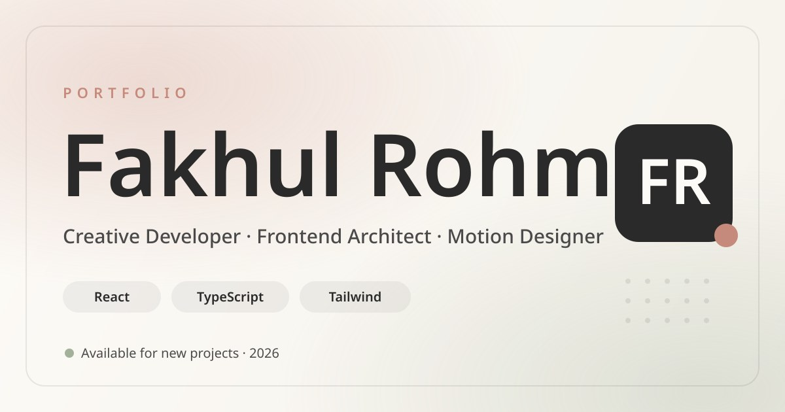

<div align="center">

# ✦ Fakhul Rohman — Portfolio ✦

### A cinematic, motion-driven personal portfolio
**Web Dev · Editing · Quality Control**

[](https://react.dev)
[](https://www.typescriptlang.org)
[](https://vite.dev)
[](https://tailwindcss.com)
[](https://www.framer.com/motion/)
[](https://threejs.org)

🌐 **Live:** [porto-fakhul.vercel.app](https://porto-fakhul.vercel.app)

</div>

---

## ✨ Overview

A single-page, immersive portfolio built with **React 19 + TypeScript + Vite**. It blends an editorial design language with **ultra-smooth motion** — WebGL backgrounds, magnetic cursor interactions, scroll-linked reveals, and a built-in AI assistant — while staying fast and accessible on low-end mobile devices.

> Replace the placeholders below with your own GIF captures (drop them in `public/` and update the paths) for an even more eye-catching README.

<div align="center">

<!-- Add your own demo GIFs here, e.g. public/demo-hero.gif -->


</div>

---

## 🎯 Features

| Area | Highlights |
| --- | --- |
| 🪐 **Hero** | WebGL / Three.js background, animated headline, magnetic CTAs |
| 👤 **About** | Story / Experience / Skills tabs, **3-variant CV download menu**, text-only **Hard Skills** with animated brand icons, mobile-friendly **Soft Skills** grid, brand photo lightbox |
| 🗂️ **Projects** | Tilt cards, category filtering, rich **Project Detail** view (2-layer hero, gallery lightbox, lightweight tech-stack reveal) |
| 🤖 **AI Assistant** | Floating chat powered by the Neoxr API (GPT-4 primary, Llama fallback) |
| ✉️ **Contact** | EmailJS-powered form with validation, loading states, and optional auto-reply |
| 🌍 **i18n** | Full **English / Indonesian / 中文** localization |
| 🎚️ **Preferences** | Settings panel: motion reduction, visual effects, audio feedback, background music |
| 🛠️ **On-device debug** | [eruda](https://github.com/liriliri/eruda) console, lazy-loaded and opt-in via `?eruda` |

---

## 🎬 Motion & Animation

- **Framer Motion** for entrance reveals, shared-layout tab indicators, and micro-interactions.
- **Three.js / React Three Fiber** for the WebGL hero backdrop (lazy-loaded, capability-gated).
- **Lenis** smooth scrolling + **GSAP** for select sequences.
- **Reduced-motion aware** — every heavy animation respects `prefers-reduced-motion` and the in-app motion toggle, so low-end phones stay smooth.

---

## 🧱 Tech Stack

- **Framework:** React 19, TypeScript, Vite 8
- **Styling:** Tailwind CSS 4
- **Animation:** Framer Motion, GSAP, Lenis, Three.js (`@react-three/fiber`, `@react-three/drei`)
- **Icons:** lucide-react + Simple Icons CDN (brand logos)
- **Integrations:** EmailJS (contact), Neoxr API (AI chat)
- **Tooling:** ESLint, TypeScript ESLint, eruda

---

## 📁 Project Structure

```
src/
├── sections/      # Hero, About, Projects, ProjectDetail, Contact, NotFound
├── components/    # UI building blocks (Navbar, Cursor, TechMarquee, …)
├── contexts/      # Language, Preferences, Toast
├── data/          # projects, techIcons, brandPhotos, music
├── lib/           # motion, aiChat, emailService, storage, eruda, …
├── config/        # ai (Neoxr), email (EmailJS)
└── locales/       # en.json, id.json, zh.json
public/
├── brand/         # avatar, cover, portraits
├── projects/      # per-project screenshots & covers
├── cv/            # ← drop your CV PDFs here (see public/cv/README.md)
└── music/         # ambient tracks
```

---

## 🚀 Getting Started

```bash
# 1. Install dependencies
npm install

# 2. Create your environment file
cp .env.example .env      # then fill in the values

# 3. Start the dev server
npm run dev

# 4. Build for production
npm run build
```

### 📜 Scripts

| Command | Description |
| --- | --- |
| `npm run dev` | Start the Vite dev server |
| `npm run build` | Type-check + production build |
| `npm run preview` | Preview the production build locally |
| `npm run lint` | Run ESLint |
| `npm run setup:emailjs` | Interactive EmailJS setup helper |

---

## 🔧 Manual Setup

Some assets and credentials must be configured by hand. **See [`SETUP.md`](SETUP.md) for the full checklist**, but in short:

- **CV PDFs** → drop 3 files in `public/cv/` (see [`public/cv/README.md`](public/cv/README.md)).
- **EmailJS** → set `VITE_EMAILJS_*` in `.env` (see [`docs/EMAILJS_SETUP_GUIDE.md`](docs/EMAILJS_SETUP_GUIDE.md)).
- **AI Assistant (Neoxr)** → optional `VITE_NEOXR_*` overrides in `.env`.
- **Brand & project images** → drop `.webp` files in `public/brand/` and `public/projects/`.

---

## 🔒 Security

This project ships with hardened HTTP headers (`vercel.json`) and a documented production checklist covering DDoS/DoS mitigation, secret handling, and abuse protection.

➡️ **Read [`docs/SECURITY_PRODUCTION.md`](docs/SECURITY_PRODUCTION.md) before going live.**

---

## ☁️ Deployment

Optimized for **Vercel** (zero-config). Push to your connected repo, set the environment variables in *Project Settings → Environment Variables*, and deploy. The included `vercel.json` handles SPA rewrites, clean URLs, and security headers.

---

<div align="center">

Built with care by **Fakhul Rohman** · Depok, West Java 🇮🇩

</div>
